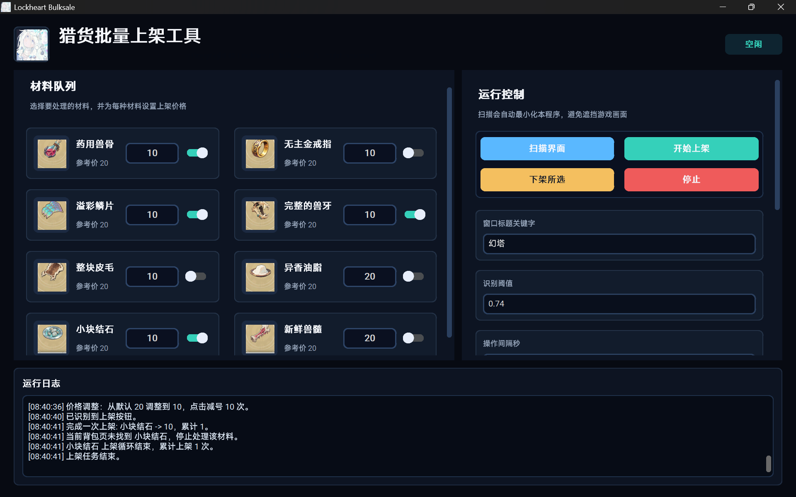
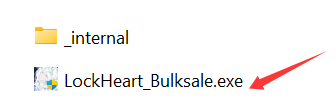
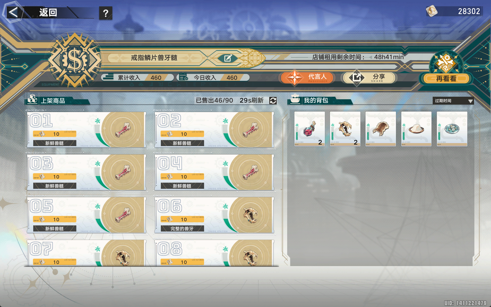
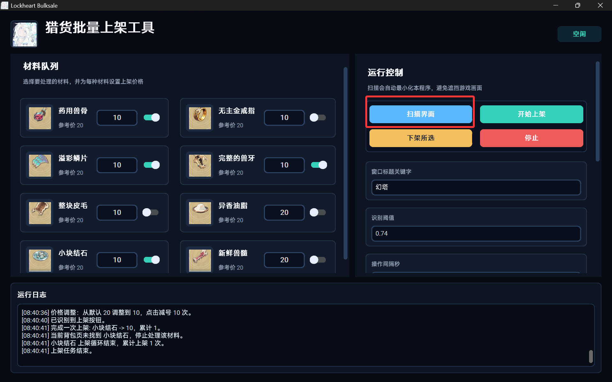
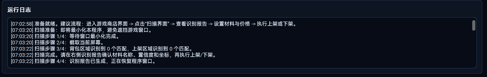
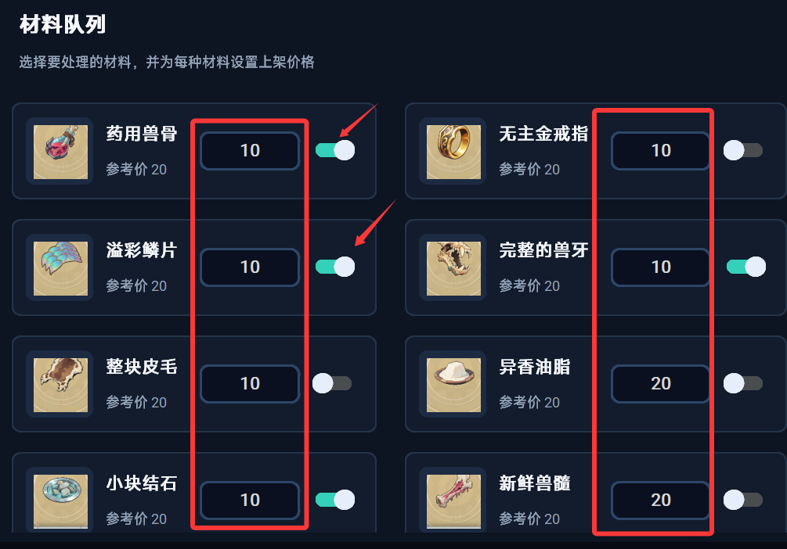

# LockHeart 批量上架助手

**工具请下载右侧最新版本的release →**

## 使用流程：

1. 解压后双击exe文件

2. 打开游戏并进入商店上架界面，需要`全屏`或者`窗口化全屏`（最大化也可以）。

3. 点击扫描界面，窗口会自动最小化扫描商店页面

通过log观察扫描是否能识别到背包/上架区域材料

4. 识别完成后设定好商品价格，以及打开需要操作的商品开关

5. 选择 `开始上架`，或 `下架所选`

